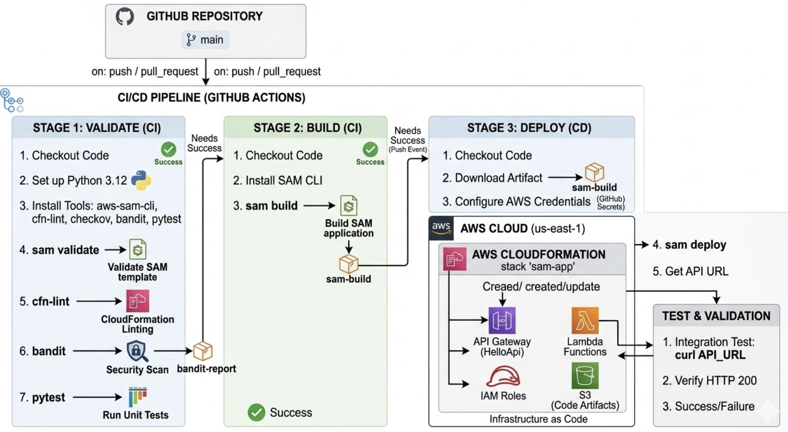

# 🚀 App Serverless CI/CD con AWS SAM y GitHub Actions

📌 Descripción:

Este proyecto implementa una aplicación serverless en AWS utilizando AWS SAM (Serverless Application Model) y un pipeline de CI/CD automatizado con GitHub Actions.

El objetivo es demostrar buenas prácticas de DevSecOps y automatización, incluyendo validaciones, análisis de seguridad, despliegue continuo y validación post deploy.

# 🧱 Arquitectura

La solución está compuesta por:
	•	AWS Lambda → Backend serverless con autoescalado
	•	Amazon API Gateway → Exposición del endpoint HTTP
	•	AWS CloudFormation (SAM) → Infraestructura como código 
	•	GitHub Actions → Pipeline CI/CD

# ⚙️ Flujo del Pipeline

El pipeline está dividido en tres etapas principales: 

## 🧪 1. Validate & Security Checks
    •	Descargar el repositorio
    •	Validación del template con SAM
    •   Linting con cfn-lint
    •	Escaneo de seguridad con Checkov
    •	Análisis de seguridad en código con Bandit
    •  Ejecución de pruebas unitarias con pytest

## 🏗️ 2. Build

    •   Construcción de la aplicación con AWS SAM
    •   Generación de artefactos en `.aws-sam/build/`
    •   Publicación del artefacto como artifact en GitHub Actions

## 🚀 3. Deploy

    •   Descarga del artefacto generado en la fase de build
    •   Autenticación con AWS mediante credenciales seguras
    •   Despliegue con AWS SAM
    •   Obtención del endpoint desde CloudFormation
    •   Validación automática del servicio mediante pruebas HTTP (curl)


## 🚀 Despliegue manual

```bash
sam build
sam deploy --guided 
```

---

## 🔐 Credenciales

```md
## 🔐 Configuración y credenciales

Se requieren los siguientes secrets en GitHub:

- AWS_ACCESS_KEY_ID
- AWS_SECRET_ACCESS_KEY

Región utilizada:
- us-east-1

Se requiere una cuenta AWS con permisos para:
- Lambda
- API Gateway
- CloudFormation


## 🌿 Estrategia de ramas

Se utiliza modelo gitflow:

- main: entorno de producción
- release : Entorno de calidad
- feature/*: desarrollo de nuevas funcionalidades

Los cambios se integran mediante Pull Requests.


## 🧪 Pruebas y validaciones

Se implementaron las siguientes validaciones:

- pytest → pruebas unitarias
- Checkov → seguridad en infraestructura
- Bandit → análisis de seguridad en código
- cfn-lint → validación de CloudFormation


## ✅ Validación del despliegue

El endpoint se valida automáticamente en el pipeline mediante:

```bash
curl https://<api-url>


## Diagrama de Arquitectura

